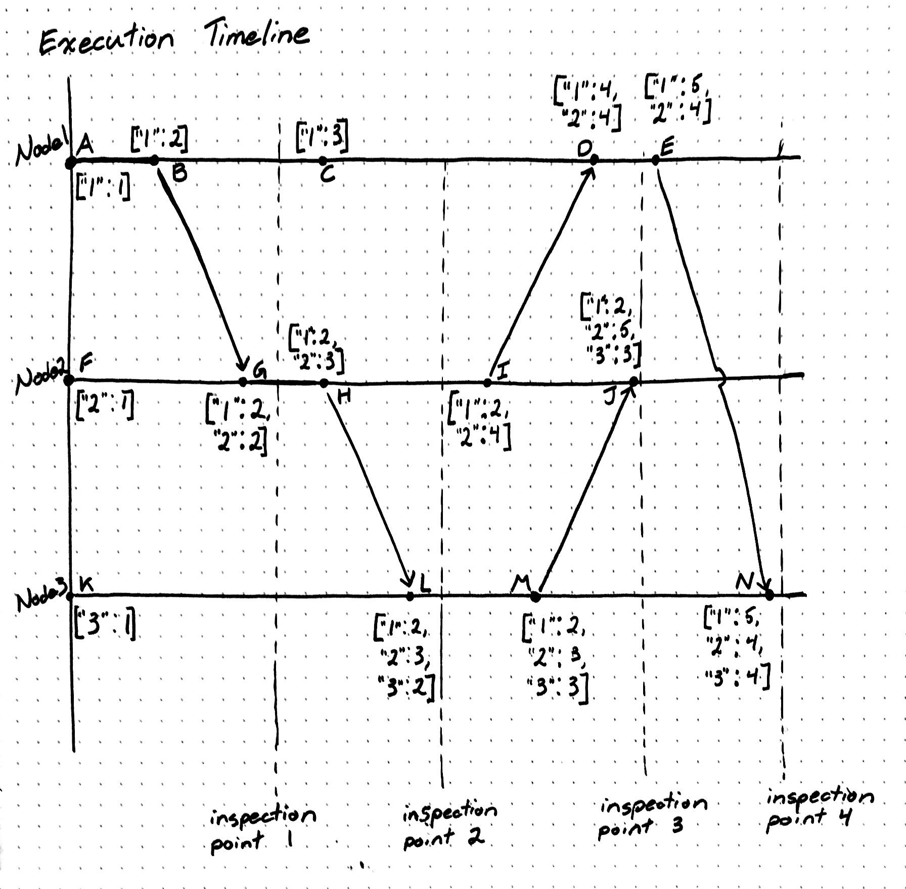
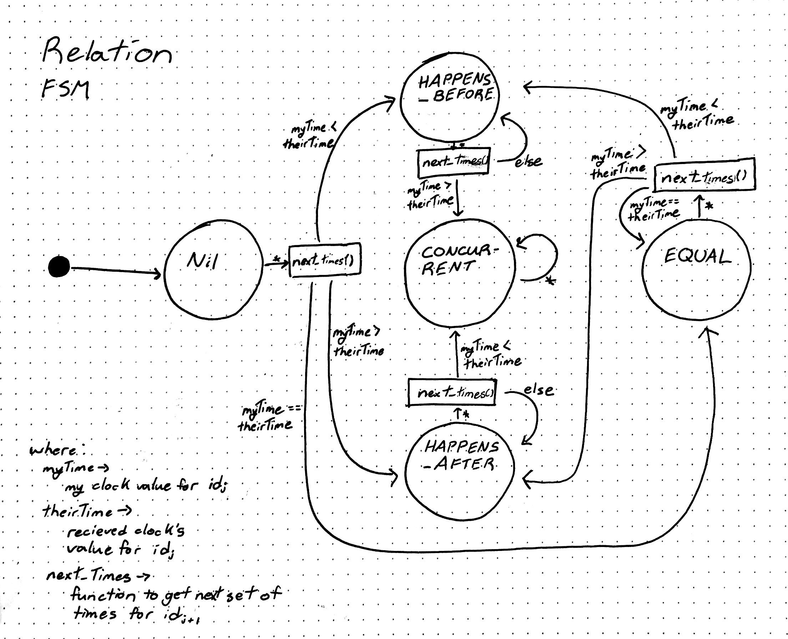

#  Vector Clocks

##  Background

First let's start with a quick background on Vector Clocks. 
Vector clocks are a tool used in concurrent programming to assist with execution order and traceability. 
At a high level, a Vector clock is a collection of Lamport Logical clocks, each are associated with a particular process (or here, node). 
When nodes communicate, the send along their vector clock, so the receiving node can update theirs. 
By looking any node's vector clock and comparing it with another's at any moment it time, it can be determined if the have a "Concurrent", "Happens Before", "Happens After", or "Equal" relationship.

For demonstrational purposes, let's assume some details: 
1. When a Node is initialized, it initialized it's own Vector Clock
2. When a Vector Clock is initialized, it contains only a single Logical Clock
3. That Vector Clock then contains a Logical Clock which is associated to that Node through some unique identifier
4. That Local Clock is incremented for every event (send, recieve, other) within the Vector Clock

Lets say our system starts by initializing 3 nodes: Node1, Node2, and Node 3. 
Each node then contains a Vector Clock with, which each contains a single Logical Clock for themselves. 

It would look something like this:  
```
Node1: ["1": 1]  
Node2: ["2": 1]  
Node3: ["3": 1]  
```

If Node1 calls Node2, their Vector Clocks will appear as follows:  
```
Node1: ["1": 2]
Node2: ["2": 2, "1": 2]
```

Where Node1 has seen two events: Initialize, and Send. 
While Node 2 has seen two events as well: Initialize, and Receive.

As execution proceeds, clocks are increments on events, and each passes their vector clock to keep one-another "up-to-date"

To test my implementation, we will actually execute and inspect this timeline in the implementation. 
We can then check at every point that the Vector Clocks are correct. 
Then, because each nodes' relationship can be determined based on a set of rules and/or graphically, we can validate the compare function. 

## Implementation

The implementation of the portion of the project was made relatively easy with the use of Swift. 
While this is my first time using the language and there is of course a learning curve, the fact that it is strongly typed and compiled made for quick debugging. 

The code is broken into three chunks: main, Node, and VectorClocks.  

The main file orchestrates the execution timeline shown in the Validation section. 
It creates nodes, triggers message sending and event occurances, and organizes the output of the program.  

The Node file's main purpose is to declare the Node class. 
The Node class is a representation of a "Process" in many vector clock explanations. 
The Node class is capable of printing it's state, comparing itself with another node, receiving an event trigger, and sending/receiving messages (and even message chains). 

The VectorClock is at the heart of this project, as it tackles implementing vector clocks, and providing functions to work with them. 
In particular the VectorClock class maintains a collection of logical clocks, can compare itself against another vector clock, and can update itself based on another vector clock. 
A highlight of the VectorClock class is the compare function, as it implements a state machine to determine it's relationship with another vector clock. 
(See the state machine in the validation section).


## Validation

Validation for this implementation was done in two fashions. 
One, to verify that vector clocks are behaving in an appropriate way. 
And two, to verify that relationships are being correctly determined.  

Following the series of events on the Execution Timeline:  


And by logging the states of each node at each inspection point:  
```
Inspection Point 1
Node1: ["1": 2]
Node2: ["2": 2, "1": 2]
Node3: ["3": 1]

Inspection Point 2
Node1: ["1": 3]
Node2: ["2": 3, "1": 2]
Node3: ["3": 2, "2": 3, "1": 2]

Inspection Point 3
Node1: ["2": 4, "1": 4]
Node2: ["3": 3, "2": 5, "1": 2]
Node3: ["3": 3, "2": 3, "1": 2]

Inspection Point 4
Node1: ["2": 4, "1": 5]
Node2: ["3": 3, "2": 5, "1": 2]
Node3: ["3": 4, "2": 4, "1": 5]
```

We see that the nodes are behaving as expected in this instance. 

Evaluating every snapshot of each vector clock, we see:  
```
(key: "A", value: ["1": 1])
(key: "B", value: ["1": 2])
(key: "C", value: ["1": 3])
(key: "D", value: ["1": 4, "2": 4])
(key: "E", value: ["1": 5, "2": 4])
(key: "F", value: ["2": 1])
(key: "G", value: ["1": 2, "2": 2])
(key: "H", value: ["1": 2, "2": 3])
(key: "I", value: ["1": 2, "2": 4])
(key: "J", value: ["1": 2, "2": 5, "3": 3])
(key: "K", value: ["3": 1])
(key: "L", value: ["1": 2, "3": 2, "2": 3])
(key: "M", value: ["1": 2, "3": 3, "2": 3])
(key: "N", value: ["1": 5, "3": 4, "2": 4])
```

Therefore we can confirm that the vector clocks are behaving correctly at every instant on the execution timeline.

Next, to validate the relation compare function, we add vector clock saving to the logging code. 
Running the following code:  
```
vectorClocks["A"]!.printCompare(vectorClocks["B"]!)
vectorClocks["B"]!.printCompare(vectorClocks["A"]!)
vectorClocks["A"]!.printCompare(vectorClocks["G"]!)
vectorClocks["C"]!.printCompare(vectorClocks["H"]!)
vectorClocks["A"]!.printCompare(vectorClocks["L"]!)
vectorClocks["I"]!.printCompare(vectorClocks["M"]!)
vectorClocks["J"]!.printCompare(vectorClocks["E"]!)
vectorClocks["E"]!.printCompare(vectorClocks["L"]!)
vectorClocks["A"]!.printCompare(vectorClocks["N"]!)
```

We get:  
```
Node1 is HAPPENS_BEFORE with Node1
Node1 is HAPPENS_AFTER with Node1
Node1 is HAPPENS_BEFORE with Node2
Node1 is CONCURRENT with Node2
Node1 is HAPPENS_BEFORE with Node3
Node2 is CONCURRENT with Node3
Node2 is CONCURRENT with Node1
Node1 is CONCURRENT with Node3
Node1 is HAPPENS_BEFORE with Node3
```

Which is just as we suspect!

To otherwise represent the code in the `compare` function, see the Relationship State Machine diagram:  



